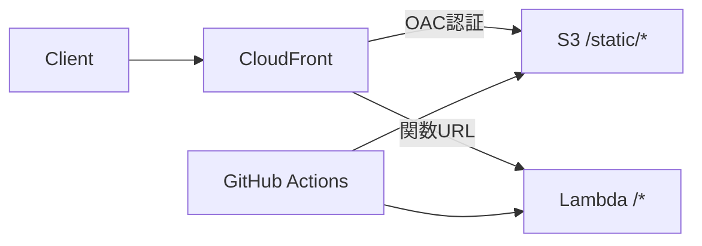

# crispy-octo-fortnight

# Application

このアプリケーションは誕生日までの日数を計算するWebアプリケーションです。

## 技術スタック

- フレームワーク: [Hono](https://hono.dev/) + [HonoX](https://github.com/honojs/honox)
- UI: [TailwindCSS](https://tailwindcss.com/)
- 言語: TypeScript
- バリデーション: Zod
- デプロイ: AWS Lambda + CloudFront + S3

## 主な機能

- 誕生日（月・日）の入力
- 次の誕生日までの日数計算
- 日付のフォーマット表示（タイムゾーン・ロケール対応）
- レスポンシブデザイン
- アクセスログ記録

## API エンドポイント

- `/api/days`: 指定された月の日数を取得
- `/api/calculate-birthday`: 誕生日までの日数を計算

# Infrastructure

## アーキテクチャ構成

このアプリケーションは以下のAWSサービスを使用してデプロイされます：

- **CloudFront**: CDNとしてキャッシュと配信を担当
  - `/static/*`: S3バケットへルーティング（静的アセット）
  - その他のパス: Lambda関数URLへルーティング（動的コンテンツ）
- **S3**: 静的アセット（JS/CSS）の保存
  - Origin Access Control (OAC)を使用してCloudFrontからのアクセスを制限
- **Lambda**: アプリケーションサーバーの実行
  - 関数URLを有効化し、CloudFrontからのリクエストを受け付け
- **GitHub Actions**: CI/CDパイプライン

## 通信フロー

1. **静的アセット配信（S3）**
   - CloudFront → OAC認証 → S3バケット
   - パブリックアクセスはブロック
   - キャッシュを活用して高速配信

2. **動的コンテンツ（Lambda）**
   - CloudFront → Lambda関数URL
   - POSTリクエストを含むすべてのHTTPメソッドをサポート
   - カスタムヘッダーによる認証

## 必要なIAMロール

下記には間違った情報が含まれます。鵜呑みにしないように。

### Lambda実行ロール
- ロール名: `BirthdayAppLambdaRole`
- 用途: Lambda関数の実行
- 必要な権限:
  - `AWSLambdaBasicExecutionRole`（CloudWatch Logs用）
    - logs:CreateLogGroup
    - logs:CreateLogStream
    - logs:PutLogEvents
  - Lambda関数URL関連
    - lambda:InvokeFunctionUrl

### GitHub Actions デプロイロール
- ロール名: `BirthdayAppDeployRole`
- 用途: GitHub ActionsからのデプロイメントとS3アップロード
- 必要な権限:
  - Lambda関連
    - lambda:UpdateFunctionCode
    - lambda:UpdateFunctionConfiguration
    - lambda:UpdateFunctionUrlConfig
  - S3関連
    - s3:PutObject
    - s3:DeleteObject
    - s3:ListBucket
  - CloudFront関連
    - cloudfront:CreateInvalidation

### CloudFront-S3アクセスロール
- ロール名: `BirthdayAppCloudFrontS3Role`
- 用途: CloudFrontからS3へのアクセス（OAC用）
- 必要な権限:
  - S3関連
    - s3:GetObject
    - s3:ListBucket

## セキュリティ考慮事項

- S3バケットは直接のパブリックアクセスを禁止し、OACを介してCloudFrontからのみアクセス可能
- Lambda関数URLはCloudFrontからのリクエストのみを許可（カスタムヘッダーによる認証）
- GitHub Actionsのデプロイロールは必要最小限の権限のみを付与
- 各環境（開発/本番）で個別のIAMロールを作成することを推奨
