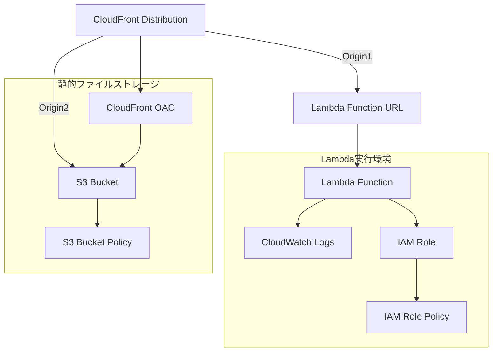

# インフラストラクチャ構成

このTerraformコードは、サーバーレスアプリケーションのインフラストラクチャを定義します。

## AWSリソース一覧

| リソースタイプ             | リソース名                                          | 説明                             |
|---------------------|------------------------------------------------|--------------------------------|
| Lambda              | aws_lambda_function.main                       | メインのLambda関数                   |
| Lambda Function URL | aws_lambda_function_url.lambda                 | Lambda関数のURL設定                 |
| CloudWatch Logs     | aws_cloudwatch_log_group.lambda                | Lambda用のロググループ                 |
| IAM Role            | aws_iam_role.lambda                            | Lambda実行用のIAMロール               |
| IAM Role Policy     | aws_iam_role_policy.lambda                     | Lambda用のIAMポリシー                |
| S3                  | aws_s3_bucket.lambda                           | 静的ファイル用のS3バケット                 |
| CloudFront          | aws_cloudfront_distribution.main               | メインのCloudFrontディストリビューション      |
| CloudFront OAC      | aws_cloudfront_origin_access_control.lambda_s3 | S3バケットアクセス用のOAC                |
| S3 Bucket Policy    | aws_s3_bucket_policy.main                      | CloudFrontからのアクセスを許可するバケットポリシー |

## アーキテクチャ図



## 主な特徴

1. アプリケーションはLambda関数として実装され、Function URLを通じて直接アクセス可能
    - Lambda側に対するアクセス制限をかけられていないため、制限をかけるのであればアプリケーション側で制御するかPOSTを無くしてOACを採用するか、Lambda@Edgeでのヘッダー付与でPOSTが通るようにするなどが必要。
2. CloudFrontが2つのオリジンを持つ:
    - Lambda Function URL（動的コンテンツ用）
    - S3バケット（静的ファイル用）
3. 静的ファイル（`/favicon.ico`と`/static/*`）はS3から配信され、CloudFrontでキャッシュされる
4. Lambda関数のログはCloudWatch Logsに365日間保存
5. セキュリティ面では:
    - S3バケットへのアクセスはCloudFront OACを通じてのみ許可
    - Lambda関数は必要最小限のIAM権限を持つ

## IAMロールと権限

### Lambda実行用IAMロール (`${local.lambda_name}-role`)

1. **信頼ポリシー（Assume Role Policy）**
    - サービス: AWS Lambda (`lambda.amazonaws.com`)
    - アクション: `sts:AssumeRole`
    - 目的: Lambda サービスがこのロールを引き受けることを許可

2. **インラインポリシー（`lambda-policy`）**
    - アクション:
        - `logs:CreateLogStream`
        - `logs:PutLogEvents`
    - リソース: CloudWatch Logsのロググループ (`/aws/lambda/${local.lambda_name}:*`)
    - 目的: Lambda関数がCloudWatch Logsにログを書き込むことを許可

### S3バケットポリシー

- **S3バケットポリシー（`aws_s3_bucket_policy.main`）**
    - プリンシパル: CloudFront (`cloudfront.amazonaws.com`)
    - アクション: `s3:GetObject`
    - リソース: S3バケット内のすべてのオブジェクト (`${aws_s3_bucket.lambda.arn}/*`)
    - 条件: CloudFrontディストリビューションのARNと一致する場合のみ
    - 目的: CloudFrontからS3バケットへのアクセスを制限的に許可

このIAM構成は最小権限の原則に従っており、各サービスに必要最小限の権限のみを付与しています。Lambda関数はログの書き込みのみ、CloudFrontはS3からのオブジェクト取得のみが許可されています。

注意: カスタムドメインとSSL証明書の設定は現在無効化されていますが、必要に応じて有効化できます。

# リリース後に実行すること

## Lambdaコードのデプロイ

Terraformでのリソース作成後はダミーのコードを使用するようにしている。
そのため、実際のアプリケーションのコードをデプロイする必要がある。
applicationの中で、 `npm run package` を実行し、作成されたlambda.zipをアップロードする。

### 環境変数の設定

CORS対策が入っている都合上、アプリケーションのドメインをLambdaに設定する必要がある。
このリソースではCloudFrontで発行されるURLをそのまま使用しているため、Lambdaの定義時にURLがわからず、後ほど設定する必要がある。
もしカスタムドメインを使用するなどドメインが既知であるなら、Lambdaのリソース作成時に環境変数を設定してしまって良い。

`ORIGIN` の名前で、CloudFrontのURLを設定する。
`ORIGIN` = `https://d3cmbodw6nb17n.cloudfront.net` のような感じ。

うまく設定できていればPOSTリクエストをした際に通る。設定できていない場合はPOSTリクエスト時に403が返る。

## S3へのリソース配置

上述の手順で `npm run package` を実行するとapplication/dist配下に `static` ディレクトリと `favicon.ico` が作成される。
このファイルたちをS3へアップロードする。S3のルート直下にフォルダごとアップロードしてしまってよい。

```text
<S3>/favicon.ico
<S3>/static/style-DvtX1mSp.css
<S3>/static/client-DmS8r_-C.js
など
```

のような構成にする。
この手順により、CloudFrontから静的ファイルを配信できる。
